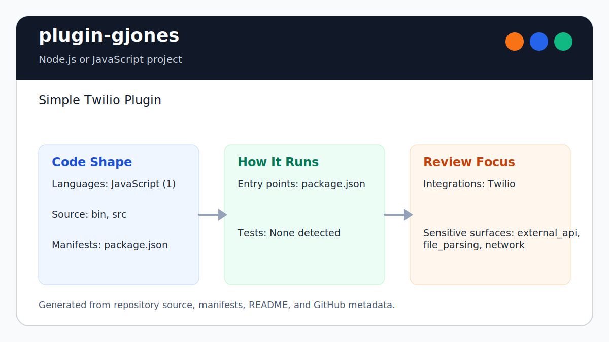

# plugin-gjones

<!-- README-OVERVIEW-IMAGE -->


## Overview

`garethpaul/plugin-gjones` is a Node.js or JavaScript project. Simple Twilio Plugin 

This README is based on the checked-in source, manifests, scripts, and repository metadata on the `master` branch. The project language mix found during review was: JavaScript (1).

## Repository Contents

- `README.md` - project overview and local usage notes
- `package.json` - JavaScript dependency and script metadata
- `bin` - source or example code
- `SECURITY.md` - security reporting and disclosure guidance
- `src` - source or example code
- `VISION.md` - project direction and maintenance guardrails

Additional scan context:

- Source directories: bin, src
- Dependency and build manifests: package.json
- Entry points or build surfaces: package.json
- Test-looking files: no obvious test files detected

## Getting Started

### Prerequisites

- Git
- Node.js and npm

### Setup

```bash
git clone https://github.com/garethpaul/plugin-gjones.git
cd plugin-gjones
npm install
```

The setup commands above are derived from repository files. Legacy mobile, Python, or JavaScript samples may require older SDKs or package versions than a modern workstation uses by default.

## Running or Using the Project

- Inspect `package.json` for available npm scripts before running the project.

Detected npm scripts:

- `npm run postpack` - `rm -f oclif.manifest.json`
- `npm run posttest` - `eslint --ignore-path .gitignore . && npm audit`
- `npm run prepack` - `oclif-dev manifest && oclif-dev readme`
- `npm run test` - `nyc --check-coverage --lines 90 --reporter=html --reporter=text mocha --forbid-only "test/**/*.test.js"`
- `npm run version` - `oclif-dev readme && git add README.md`

## Testing and Verification

- `npm test`

When the required SDK or runtime is unavailable, use static checks and source review first, then verify on a machine that has the matching platform toolchain.

## Configuration and Secrets

- Detected references to Twilio. Keep API keys, OAuth credentials, tokens, and account-specific values in local configuration only.

## Security and Privacy Notes

- Review changes touching external API calls or credential-adjacent configuration; examples from the scan include bin/run, package.json, src/commands/gjones/mycommand.js.
- Review changes touching network requests, sockets, or service endpoints; examples from the scan include appveyor.yml, package.json.
- Review changes touching file, media, JSON, XML, CSV, OCR, or data parsing; examples from the scan include appveyor.yml, package.json.

## Maintenance Notes

- See `SECURITY.md` for vulnerability reporting and safe research guidance.
- See `VISION.md` for project direction and contribution guardrails.

## Contributing

Keep changes small and tied to the project that is already present in this repository. For code changes, document the toolchain used, avoid committing generated dependency directories or local configuration, and update this README when setup or verification steps change.

## Existing Project Notes

Prior README summary:

> @garethpaul/plugin-debugger ======================== Access and stream your Twilio debugger logs. <!-- toc --> * [Usage](#usage) * [Commands](#commands) <!-- tocstop --> Setup
